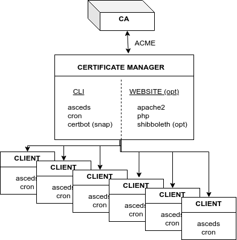

Welcome to ASCEDS's documentation!
===================================

**Automated SSL Certificate Distribution System (ASCEDS)**
is a distribution system for certificates 
which can be obtained from a provider offering an ACME interface. 
The system defines a site containing:

* one certificate manager which can get SSL certificates for wilcard 
  hostnames in a set of domains through certbot;
* a set of managed clients getting automatic certificate renewal or
  reconfiguration of SANs; services using certificates are 
  reconfigured/restarted automatically upon renewal;
* a web interface handling certificates for managed or unmanaged
  clients.

ASCEDS was developed by Florin Manolache at Carnegie Mellon University 
for interfacing certbot with InCommon SSL certificates, 
and automatically distributing them to the servers on the network.

ASCEDS is released under GPLv2 or any later version.

Check out the :doc:`usage` section for further information, including
how to :ref:`install` the project.

.. note::

   This project is under active development.

Contents
--------

.. toctree::

   quickstart
   usage
   build
   web
